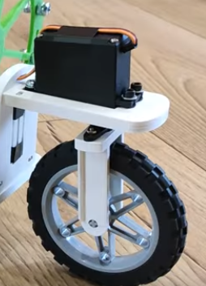
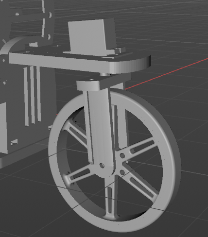
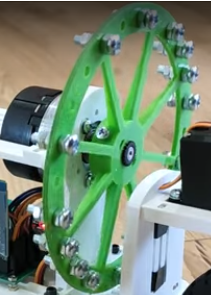
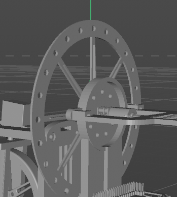
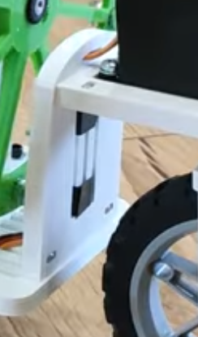
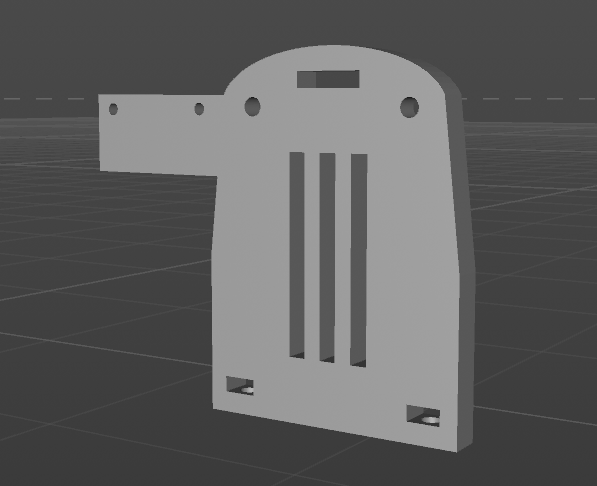
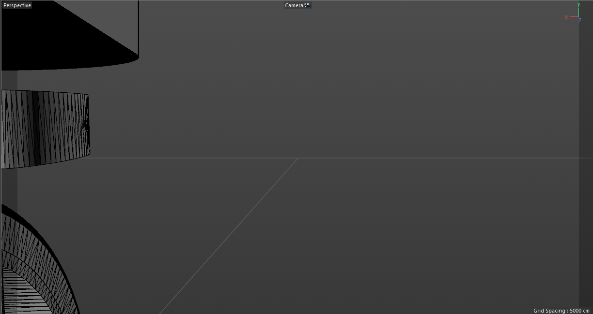
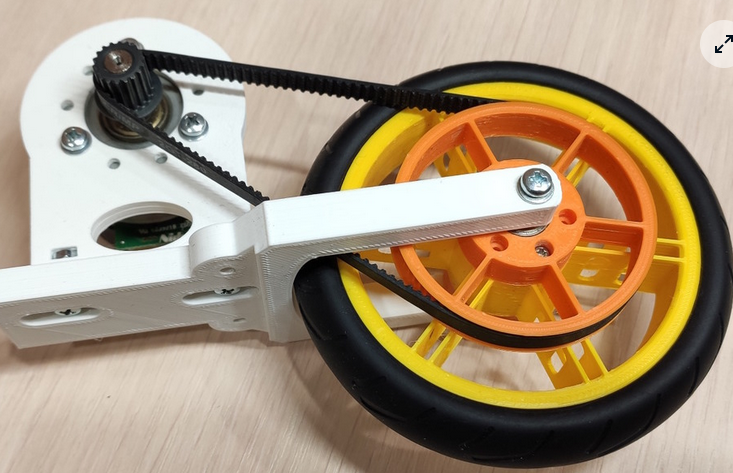
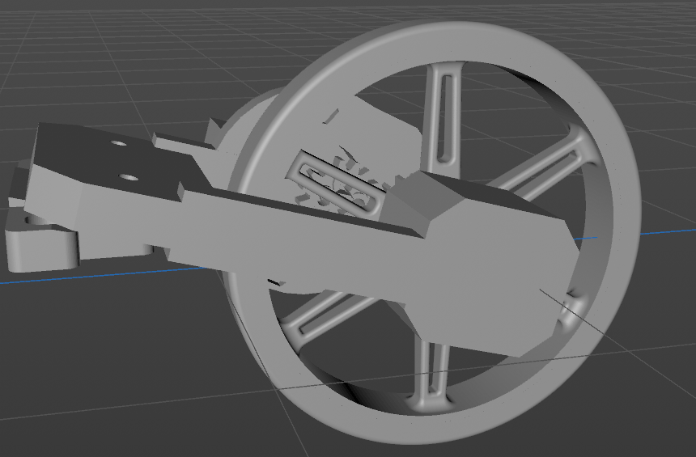

# KAneda-JFG

Motocicleta auto-balanceable capaz de reconocer señales de tráfico mediante visión por computador.

## Tabla de Contenidos

+ [Descripción del Proyecto](#descripción-del-proyecto)
+ [Componentes Electrónicos](#componentes-electrónicos)
+ [Componentes Mecánicos](#componentes-mecánicos)
+ [Esquema Eléctrico](#esquema-eléctrico)
+ [Diseño 3D](#diseño-3d)
+ [Arquitectura del Software](#arquitectura-del-software)
+ [Algorítmica](#algorítmica)
+ [Visión por Computador](#visión-por-computador)
+ [Simulación](#simulación)
+ [Contribuciones y Agradecimientos](#contribuciones-y-agradecimientos)
+ [Autoría](#autoría)
+ [Bibliografía](#bibliografía)

## Descripción del Proyecto

Este proyecto de motocicleta auto-balanceable surge con la visión de desarrollar un vehículo autónomo capaz de detectar y obedecer las señales de tráfico sin la intervención de un conductor. El propósito principal es brindar a la Dirección General de Tráfico (DGT) una herramienta para llevar a cabo demostraciones y programas educativos sobre seguridad vial. Utilizando técnicas avanzadas de visión por computador, nuestra moto puede interpretar y responder de manera precisa a las señales del entorno, lo que la convierte en un prototipo innovador en el campo de la movilidad autónoma.

La tecnología de auto-balanceo de la motocicleta se basa en el proyecto [Self-Balancing-Bike](https://github.com/remrc/Self-Balancing-Bike), realizado por [remrc](https://github.com/remrc) en Arduino.

## Componentes Electrónicos

| Componente | Imagen | Componente | Imagen |
| --- | --- | --- | --- |
| [Kit Raspberry Pi Zero W + MicroSD 32GB](https://tienda.bricogeek.com/placas-raspberry-pi/1082-kit-basico-raspberry-pi-zero-wifi-microsd-32gb.html) |  | [Cámara Raspberry Pi v2 - 8 Megapíxeles](https://tienda.bricogeek.com/accesorios-raspberry-pi/822-camara-raspberry-pi-v2-8-megapixels.html) |  |
| [Cable cámara Raspberry Pi Zero (30cm)](https://tienda.bricogeek.com/accesorios-raspberry-pi/1562-cable-camara-raspberry-pi-zero-30cm.html) |  | [Módulo GY-521 Acelerómetro y Giroscopio MPU-6050](https://tienda.bricogeek.com/acelerometros/1682-modulo-gy-521-acelerometro-y-giroscopio-mpu-6050.html) |  |
| [Micro servo miniatura SG90](https://tienda.bricogeek.com/servomotores/968-micro-servo-miniatura-sg90.html) |  | [Motor paso a paso 28BYJ-48 (5V) con driver ULN2003](https://tienda.bricogeek.com/motores-paso-a-paso/969-motor-paso-a-paso-28byj-48-5v-con-driver-uln2003.html) |  |
| [Motor Micro Metal LP con reductora 10:1](https://tienda.bricogeek.com/motores/113-motor-micro-metal-lp-con-reductora-10-1.html) |  | [Controlador de motores TB6612FNG](https://tienda.bricogeek.com/controladores-motores/999-controlador-de-motores-tb6612fng.html) |  |
| [Bateria Lipo 1000mAh / 3.7V - 603050](https://tienda.bricogeek.com/baterias-lipo/135-bateria-lipo-1000mah-603050-37v.html) |  | [Cargador LiPo PowerBoost 500](https://tienda.bricogeek.com/convertidores-de-voltaje/677-cargador-lipo-powerboost-500.html) |  |

## Componentes Mecánicos

### Movimiento

| Componente | Imagen | Unidades |
| --- | --- | --- |
| [Rueda Solarbotics antideslizante](https://tienda.bricogeek.com/robotica/230-rueda-solarbotics-antideslizante.html) |  | 2 |
| [Rodamiento 608-2RS (8x22x7mm)](https://tienda.bricogeek.com/rodamientos/1294-rodamiento-608-2rs-8x22x7mm.html) |  | 2 |

### Tornillos

| Métrica | Longitud (cm) | Partes | Unidades | Tuercas |
| --- | --- | --- | --- | --- |
| M1 | 1 | Soporte Motor - Motor | 2 | Sí |
| M2 | 1 | Cámara | 2 | Sí |
| M2 | 2 | Servo | 2 | Sí |
| M3 | 1 | Soporte Stepper | 2 | Sí |
| M3 | 1,5 | Manillar, Frontal - Base, Base - Motor, Soporte Motor - Soporte Motor, Soporte Motor - Soporte Motor, Soporte Motor - Base | 12 | Sí |
| M3 | 2 | Culo | 4 | Sí |
| M3 | 3 | Base - Base | 2 | Sí |
| M4 | 0,5 | Volante de Inercia | 16 | Sí |

## Esquema Eléctrico

## Diseño 3D

Para el diseño 3D se ha optado por emplear los softwares FreeCAD y Cinema4D debido a que uno de los integrantes ya estaba familiarizado con él. El esqueleto de la motocicleta ha venido dado por el proyecto realizado por remrc, el cual tiene compartido en la página Thingiverse los [modelos](https://www.thingiverse.com/thing:5887157/files) que ha utilizado.

Estos modelos se han modificado para adecuarlos a nuestros componentes y de esta manera no exceder el presupuesto proporcionado por el profesorado. Los modelos han sido modificados de la siguiente manera.

### Manillar

Para el manillar, se ha utilizado el micro-servo SG90, por ello, ha sido necesario adaptar la pieza donde se asienta este componente.

| Antes | Después |
| --- | --- |
|  |  |

### Volante de inercia

El volante de inercia es el alma de esta motocicleta, por tanto su diseño se ha intentado mantener con respecto al utilizado por remrc. En nuestro caso, hemos adaptado el eje de adhesión para asegurar la compatibilidad con nuestro motor pololu.

| Antes | Después |
| --- | --- |
|  |  |

### Cámara RPi

La motocicleta tiene soporte para utilizar visión por computador, por ello, se ha modificado la pieza que une al manillar con el cuerpo central de la motocicleta. La cámara se situaría en un lateral, esto es debido a que si se situase al frente del vehiculo, el cable no sería suficiente para llegar hasta el cuerpo central. La visión se vería ligeramente mermada a un lado por el propio manillar y la rueda delantera pero no debería suponer ningún problema.

| Antes | Después |
| --- | --- |
|  |  |

| Visión de la cámara |
| --- |
|  |

### Parte posterior

La parte posterior de la motocicleta ha sido completamente rediseñada desde cero debido al límite presupuestario. En un principio remrc utilizaba un stepper y una correa para transmitir la potencia a la rueda trasera, nosotros hemos optado por utilizar un micro-stepper y transmitir la potencia mediante el uso de dos engranajes de 16 dientes, disponibles en [thingiverse](https://www.thingiverse.com/thing:146289). Además, hemos optado por añadir un rodamiento de 22mm x 8mm para mitigar las imprecisiones que puedan surgir utilizando un eje transversal e impresión 3D. Con ello, nuestra parte trasera quedaría tal que así.

| Antes | Después |
| --- | --- |
|  |  |

## Arquitectura del Software

Kaneda-JFG se compone de los siguientes módulos:

### Módulo de Detección de señales

### Módulo de control de la inclinación

### Módulo de control de la moto

### Módulo de Interacción HW/SW

## Algorítmica

### Filtro de Kalman

Para poder controlar la orientación de la moto y evitar que se caiga, hemos pensado en implementar el famoso algoritmo conocido como **Filtro de Kalman**.

#### Breve descripción del filtro de Kalman

El filtro de Kalman se trata de un algoritmo que puede estimar parámetros observables y no observables con gran precisión en tiempo real. Es utilizado para estimar las variables de un sistema basándose en medidas con ruido, calcula las diferentes probabilidades del estado de un sistema. Lo podemos ver como una caja negra, donde las entradas son ruidosas y, a veces, contienen mediciones inexactas. Y los resultados son menos ruidosos y tienen más precisión.

Este algoritmo es muy utilizado en robótica y sistemas en tiempo real que necesitan información confiable. Su importancia recae en poder estimar parámetros del sistema que no se pueden medir u observar con precisión, permitiendo así a los sistemas tener un mayor control y, por tanto, más capacidades.

Este algoritmo se basa principalmente en 2 pasos:

1) **Predicción:** Donde, basándose en el estado anterior del sistema se predice el estado actual del sistema y su incertidumbre.
2) **Actualización (o Corrección):** Se utilizan las mediciones actuales para actualizar la estimación del estado y reducir la incertidumbre (el ruido). 

Estos 2 pasos se repiten en cada paso de tiempo para producir una estimación del estado de forma más precisa.

#### ¿Cómo encaja con nuestro proyecto?

Precisamente, por lo explicado en el subapartado anterior, el filtro de Kalman se trata de una herramienta poderosa que nos permitirá obtener la futura inclinación que tomará la moto antes de que ocurra.
De esta manera, sabiendo este dato, nos permitirá corregir la inclinación de la moto ajustando los parámetros del volante de inercia (ajustando potencia y dirección) según la inclinación de la moto.

## Visión por Computador

## Simulación

## Contribuciones y Agradecimientos

## Autoría

## Bibliografía
